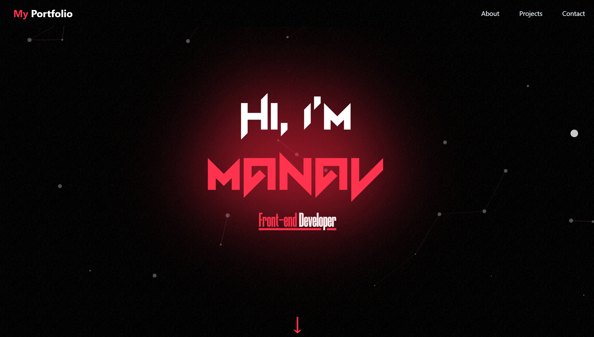

# Personal Portfolio

[](https://portfolio-manav-gopal.vercel.app/)

### [Live Demo](https://portfolio-manav-gopal.vercel.app/)

Welcome to my personal portfolio website, where I showcase my projects, skills, and experience as a Frontend Developer.


## Overview

This portfolio is designed to provide an interactive, responsive user experience. It highlights my expertise in web development, focusing on smooth navigation, dynamic animations, and project displays with transitions.

## Technologies Used

- **React:** Frontend framework for building user interfaces.
- **TypeScript:** For type-safe coding and scalability.
- **Tailwind CSS:** Utility-first CSS framework for designing a modern and responsive layout.
- **Framer Motion:** For implementing smooth animations and transitions.

## Features

- **Introduction Section:** A brief overview of who I am and my professional journey.
- **Projects Section:** Dynamic project displays with descriptions, technologies used, and links to their repositories.
- **Contact Form:** An interactive form for visitors to get in touch with me.
- **Social Media Integration:** Links to my LinkedIn, GitHub, and Twitter profiles.
- **Responsive Design:** Optimized for various screen sizes from desktop to mobile.
- **Smooth Navigation:** Implemented using animations and transitions for a seamless user experience.

## Setup and Installation

To run the project locally:

1. Clone the repository:
   ```bash
   git clone https://github.com/your-username/portfolio.git
   ```

2. Navigate to the project directory:
   ```bash
   cd portfolio
   ```

3. Install dependencies:
   ```bash
   npm install
   ```

4. Start the development server:
   ```bash
   npm start
   ```

## Contact

Feel free to reach out to me through:
- [LinkedIn](https://www.linkedin.com/in/yourprofile)
- [X](https://x.com/ManavGopal2)

---

Thank you for visiting my portfolio!
